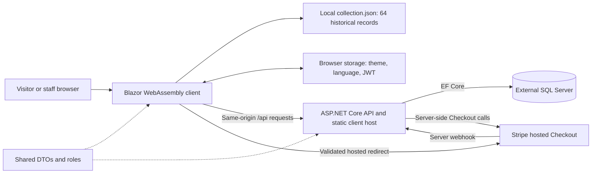

# Frontend architecture

**Status:** confirmed from source at `39a8ecc`. **Updated:** October 3, 2026.

## System boundary

Mark's Baseball Cards has three .NET projects. The browser runs the Blazor client;
the API hosts its compiled assets and provides protected data/services. Shared
contains DTOs and role names. The client does not connect to SQL Server or hold
Stripe/JWT signing secrets.

This describes checked-out code dependencies, not production topology. The actual
SQL host, public domain, TLS termination and Stripe configuration need Hank's evidence.

## Projects and declared versions

| Project / dependency | Version or target | Role |
| --- | --- | --- |
| Client, API, Shared | `net10.0` | Runtime/project target |
| Client Blazor WebAssembly, Authorization, DevServer, Microsoft.Extensions.Http | `10.0.9` | Browser rendering, auth state, local development and HTTP |
| API JWT bearer, Blazor host, OpenAPI and EF Core SQL Server/Design | `10.0.9` | Existing server implementation |
| Stripe.net | `52.1.0` | Existing server payment SDK |

Sources: [client project](../../src/Client/MarksBaseballCards.Client.csproj),
[API project](../../src/Api/MarksBaseballCards.Api.csproj),
[shared project](../../src/Shared/MarksBaseballCards.Shared.csproj).
These are declared versions, not a claim that they are current or vulnerability-free.
The prior dependency audit is preserved in the [security review](../security/security-review.md).

## Hosting and origin

[Client Program.cs](../../src/Client/Program.cs) registers an HTTP client with
`HostEnvironment.BaseAddress` and a 20-second timeout. Requests are relative
`api/...` paths. There is no separate API URL setting or development proxy.

[API Program.cs](../../src/Api/Program.cs) initializes SQL/migrations/seeding before
serving requests, then registers Blazor framework/static assets, controllers and
an `index.html` fallback. [The API project](../../src/Api/MarksBaseballCards.Api.csproj)
references Client, and its [Dockerfile](../../src/Api/Dockerfile) publishes both.

Consequently:

- A standalone client preview serves the public archive and layout without SQL.
- Starting another API port does not connect that preview to it.
- Integrated development uses the frontend at the API's origin.
- A database startup failure can prevent even the API-hosted public pages from being served.
- Hosting the frontend at a subpath or a separate domain requires code/configuration
  changes; the current HTML base is `/` and no such deployment is documented.

## Client composition

[App.razor](../../src/Client/App.razor) supplies the router, authentication cascade,
authorized-route view and focus-on-navigation. [MainLayout](../../src/Client/Layout/MainLayout.razor)
owns the shared frame and JS motion lifecycle. Pages use shared components and
typed services rather than creating independent network or translation layers.

- `CollectionCatalog`: local archive loading/cache and retry after a failed load.
- `ApiClient`: typed API reads/mutations and recoverable mutation results.
- `ClientAuthService`, `TokenStore`, `JwtAuthenticationStateProvider`: staff login,
  browser bearer storage and navigation state.
- `UiPreferences`: embedded translations, locale formatting and display notifications.
- `preferences.js`: initial browser appearance/language before CSS and Blazor.
- `ui.js`: animation observers, scroll/pointer behavior and native dialog helpers.

See [technical design](technical-design.md) for exact files and
[diagrams](diagrams.md) for initialization and checkout sequences.

## Authentication boundary

The browser reads JWT claims and expiry to display the appropriate UI. It does not
verify the token's signature. The API validates signature, issuer, audience and
lifetime, then enforces route roles. Editing browser state cannot authorize an API
operation. `SystemAdmin` is not an implicit superset of `Admin`.

The token lives in browser `localStorage`; removing it on logout does not revoke a
copied token. This is an existing security limitation, documented in
[SEC-08](../security/security-review.md#sec-08--the-admin-jwt-is-stored-in-browser-localstorage).

## Architectural records

[ADR index](adr/README.md) records three implemented frontend choices:
native motion within Blazor, separate archive/live inventory, and embedded UI
translations with browser preferences. Backend architecture decisions remain
pending Hank where no frontend evidence explains their rationale.
