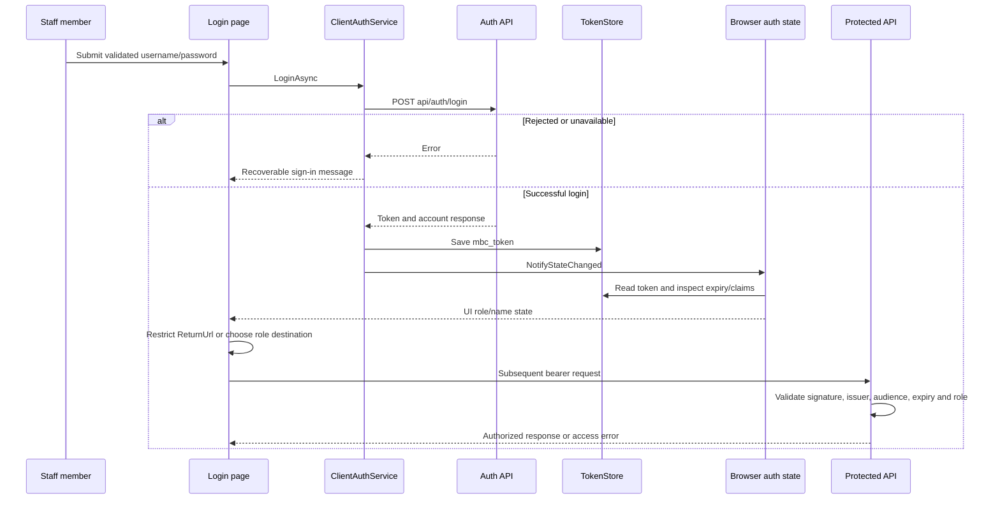
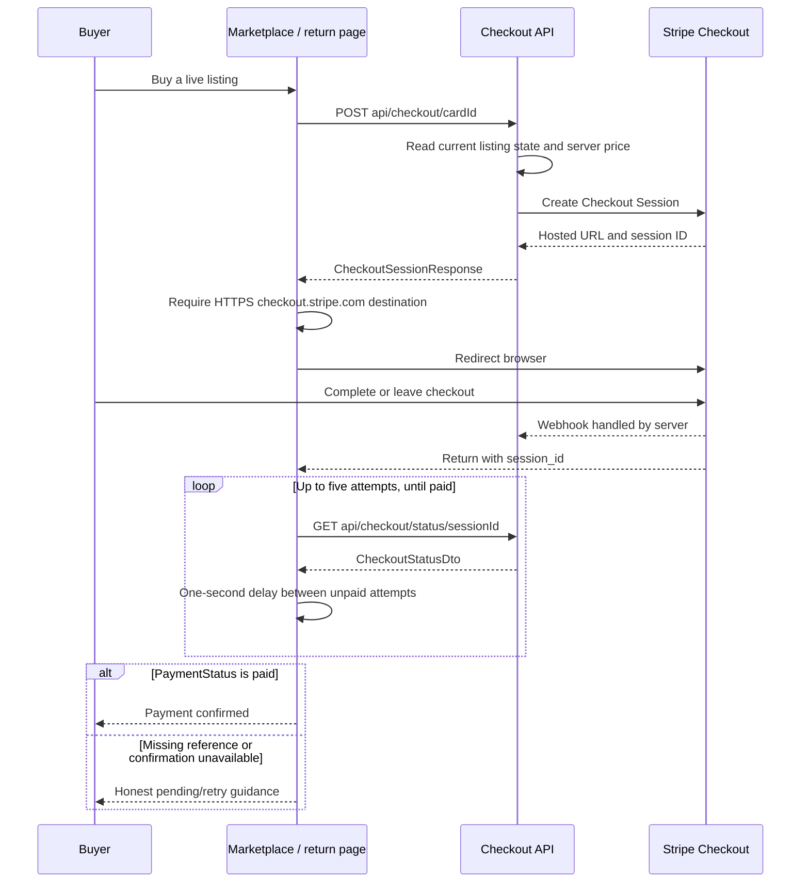
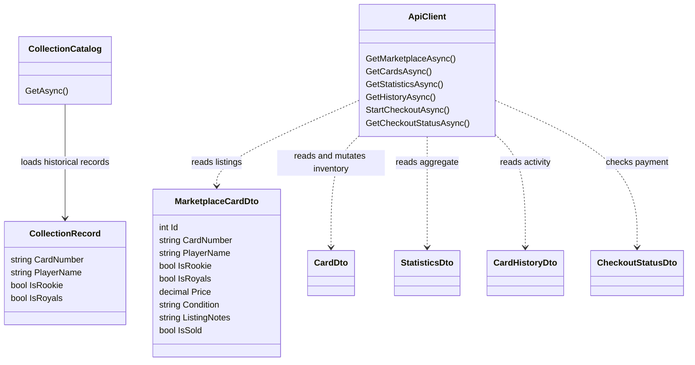

# Frontend flows and contract diagrams

**Status:** diagrams of inspected source. **Updated:** October 3, 2026.

The [architecture overview](architecture.md) contains the system context diagram.
These diagrams describe frontend behavior; they are not a production infrastructure
map or a complete database ERD.

## Display preferences before the first render

```mermaid
sequenceDiagram
    participant HTML as index.html
    participant JS as preferences.js
    participant Storage as Browser storage and settings
    participant CSS as Styles
    participant WASM as Blazor startup
    participant Pref as UiPreferences
    participant UI as Razor components

    HTML->>JS: Run before stylesheet links
    JS->>Storage: Read saved language/theme if available
    Storage-->>JS: Saved choices or browser defaults
    JS->>HTML: Set lang, data-theme and boot metadata/copy
    HTML->>CSS: Load local font, app and theme styles
    HTML->>WASM: Load blazor.webassembly.js
    WASM->>Pref: InitializeAsync
    Pref->>JS: htsPreferences.read
    JS-->>Pref: Current choices
    WASM->>UI: First render
    UI->>Pref: SetLanguageAsync or ToggleThemeAsync
    Pref->>JS: Apply and attempt persistence
    Pref-->>UI: Changed event; refresh copy in place
```

Source: [index.html](../../src/Client/wwwroot/index.html),
[preferences.js](../../src/Client/wwwroot/js/preferences.js),
[Program.cs](../../src/Client/Program.cs), [UiPreferences](../../src/Client/Services/UiPreferences.cs).
Storage failure leaves display preferences usable for the current session.

## Staff sign-in and server authority



Browser claims are UI state, not verified authorization.
See [auth sources](../../src/Client/Auth) and [API validation](../../src/Api/Program.cs).

## Buyer checkout and payment status



Payment and webhook ordering can vary. A return visit is not a payment guarantee.
Backend reservation, delayed-payment events and reconciliation limitations are in
[SEC-02 and SEC-09](../security/security-review.md). Leaving the return page cancels
its polling loop; it may not abort a status request already in flight.

## Client contract map



Nullable price, condition and notes are simplified in the diagram; exact C# types
are in [MarketplaceCardDto](../../src/Shared/Models/MarketplaceCardDto.cs).
No database relationship between archive records and live inventory is implied.
