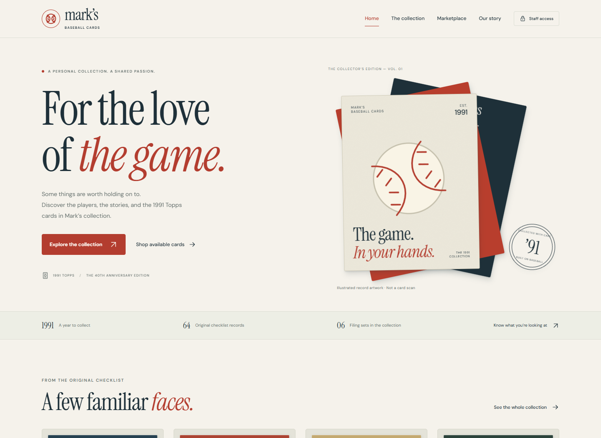
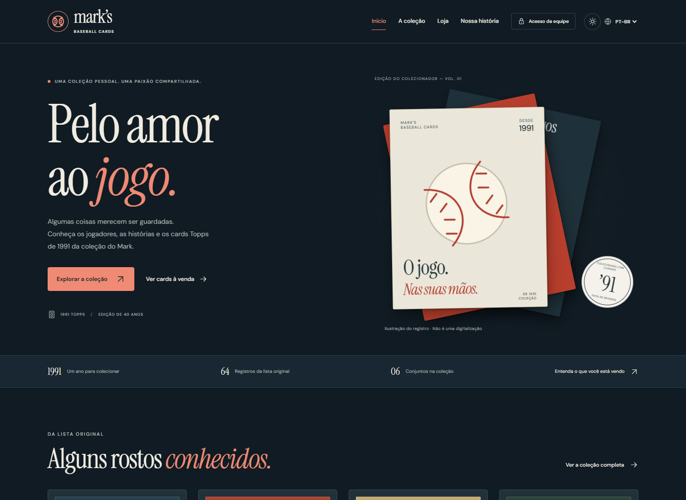

# Frontend preview captures

Captured from the local Blazor client on October 2, 2026.

- [Home — desktop, full page](home-desktop.png)
- [Home — desktop, first screen](home-desktop-viewport.png)
- [Home — mobile, full page](home-mobile.png)
- [Home — mobile, first screen](home-mobile-viewport.png)
- [Collection — desktop](collection-desktop.png)
- [Collection — mobile](collection-mobile.png)
- [Collection record dialog](collection-details.png)
- [Marketplace — unavailable service state](marketplace-unavailable.png)
- [Staff sign-in](staff-login.png)

The collection uses the actual 64-record original checklist. The unavailable marketplace capture reflects the standalone client running without a configured API. Staff accounts and real payments were not simulated.

See [the frontend reference notes](../phase-2-design/ui-references.md) for the implementation and runtime requirements.

## Dark theme and languages

- [Dark Portuguese home — full page](home-dark-ptbr.png)
- [Dark Spanish home](home-dark-es-viewport.png)
- [Light Spanish home](home-light-es-viewport.png)
- [Dark Portuguese mobile home](home-dark-mobile-ptbr-viewport.png)
- [Dark Portuguese mobile home — full page](home-dark-mobile-ptbr.png)
- [Dark Portuguese collection](collection-dark-ptbr.png)
- [Dark Portuguese mobile collection](collection-dark-mobile-ptbr.png)
- [Dark Portuguese staff sign-in](staff-login-dark-ptbr.png)
- [Dark Spanish collection details](collection-details-dark-es.png)
- [Dark Spanish collection details — mobile](collection-details-dark-es-mobile.png)
- [Dark Spanish collection story](about-dark-es.png)
- [Dark Spanish marketplace — unavailable service state](marketplace-dark-es.png)

See [Themes and Languages](../phase-3-development/themes-and-languages.md) for the controls and translation scope.
